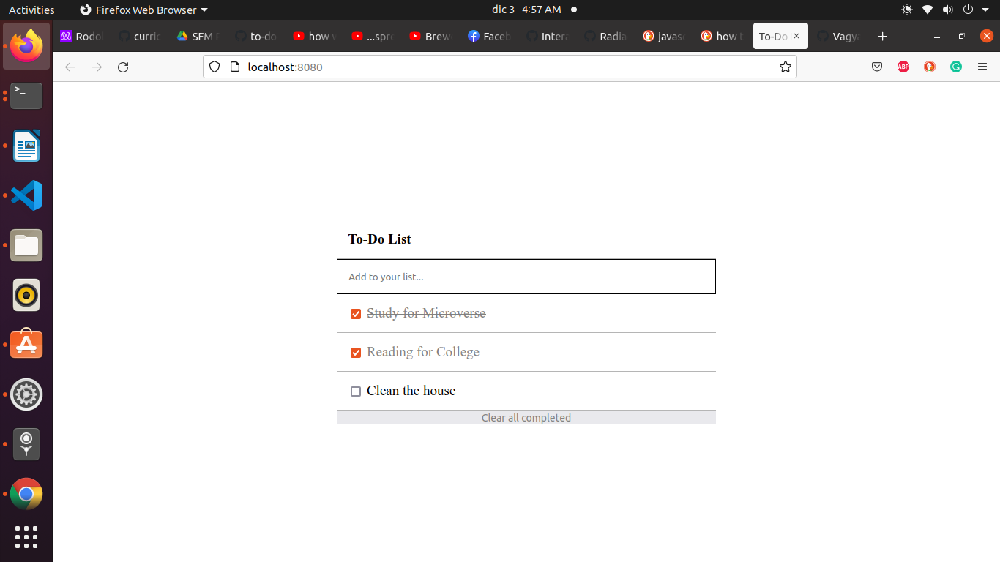

# ToDo List

> "ToDo List" is a simple website that displays a list of activities and allows you to add and remove tasks from that list. In order to achieve this project we rewrote some of our function definitions into class expressions to apply JavaScript best practices and styling the core elements. This app serves the purpse of tracking your activities for the day


### ScreenShoot



## Built With

- HTML
- CSS 
- JavaScript Classes
- Linters
- Vscode

## Live Demo

[Live Demo](https://radiactivejesus.github.io/ToDo-List/)

## Getting Started

To get a local copy up and running follow these simple example steps.

### Prerequisites

- Node and NPM
- Web browser (Google chrome)
- Code Editor (VSCode)

### Development (Running locally)

- git clone the project

```bash 
git clone git@github.com:RadiactiveJesus/ToDo-List.git
```

- Install Dependencies

```bash
npm install
```
Inorder to bundle the app, is probable you need to install yarn first

```bash
yarn install
```

To run StyleLint by itself, you may run the lint task:

```bash
npx stylelint "**/*.{css,scss}"
```

Or to automatically fix issues found (where possible):

```bash
npx stylelint "**/*.{css,scss}" --fix
```

You can also check against Webhint:

```bash
npx hint --telemetry=off .
```

### Usage
Run `npm run build` to bundle automatically some necesary dependencies of the profect.

```
npm run build
```

Run `npm run start` to start the local server and try the app.

```
npm run start
```

### Run locally
Open dist/index.html in live server from the command line on root folder

```
npm run start
```

  ## 👤 **Rodolfo**

- Github: [@RadiactiveJesus](https://github.com/RadiactiveJesus)
- Twitter: [@LlinasCuadro](https://twitter.com/LlinasCuadro)
- Linkedin: [Rodolfo Llinás](https://www.linkedin.com/in/rodolfo-llin%C3%A1s-691b50181/)


## 🤝 Contributing

Contributions, issues and feature requests are welcome!

Feel free to check the [issues page](https://github.com/RadiactiveJesus/ToDo-List/issues).

## Show your support

Give a ⭐️ if you like this project!

## Acknowledgments

- Hat tip to anyone whose code was used
- Inspiration, resources/assets used
- etc

## 📝 License

[MIT licensed](https://github.com/Debas-31/awesomebooks/blob/Milestone-1-manage-book-collection/MIT.md).